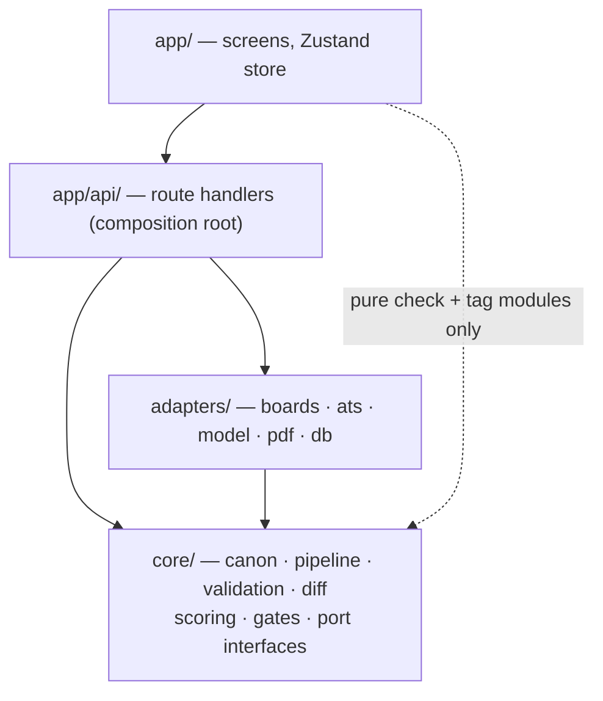
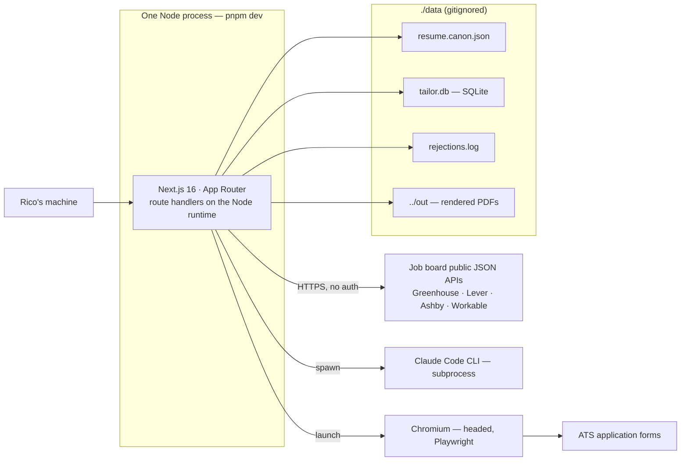
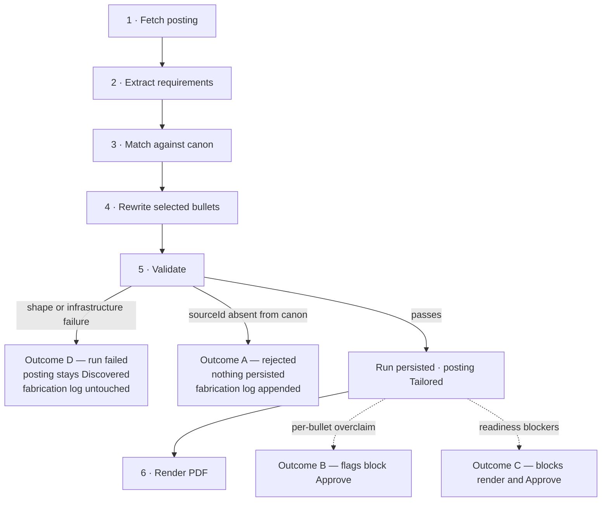
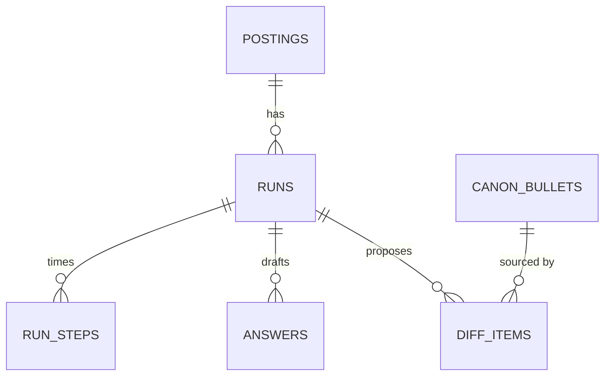

# Architecture Spine — tailor

## Design Paradigm

**Hexagonal (ports and adapters)**, with the tailoring run modeled as **pipes and filters** inside the core.

The domain core holds everything that decides truth — canon access, the six-stage run pipeline, validation, diff construction, scoring, tag extraction, the render-readiness gate. It defines interfaces; it implements none of them. Every external system reaches it through an adapter: four job boards, four ATS vendors, the model CLI, the PDF renderer, the database.

The trust premise of this product is that nothing reaches the resume without passing validation. The hexagon makes that a structural fact rather than a discipline.

| Layer | Directory | May depend on |
| --- | --- | --- |
| Domain core | `core/` | Nothing outside itself |
| Adapters | `adapters/` | `core/` (its port interfaces) |
| Composition + edge | `app/api/` | `core/`, `adapters/` |
| UI | `app/` | `app/api/` over HTTP; `core/` **only** for the pure isomorphic modules named in AD-7 and AD-11 |

## Invariants & Rules



Everything points at `core/`. `core/` points at nothing. That arrow direction is the rule.

### AD-1 — The domain core has no outward imports

- **Binds:** all of `core/`
- **Prevents:** the core acquiring Next.js, Drizzle, Playwright, `node:fs`, or CLI dependencies — which would make validation bypassable by convenience, break the spec's promise that an API-key model implementation swaps in with no other file touched, and make the core untestable without a database.
- **Rule:** no file under `core/` may import from `app/`, `adapters/`, `next/*`, `drizzle-orm`, `playwright`, or any Node built-in. It receives capability through the port interfaces it defines.

### AD-2 — Four port families, adapters behind each `[ADOPTED]`

- **Binds:** CAP-1, CAP-3, CAP-10, CAP-11
- **Prevents:** external-system detail leaking into the core, and each vendor growing a bespoke call shape that the core has to know about.
- **Rule:** boards (`fetchJobs(boardUrl)`), ATS (`fill(page, job, pdfPath, answers)`), model (`tailor(input)`), PDF render, and database access each sit behind a core-defined interface. Adapters are selected in the route handler, never inside the core. Signatures for the board, ATS, and model ports are fixed by the spec and are not re-opened here.

### AD-3 — A tailoring run is a background job with polled step state

- **Binds:** CAP-3, CAP-4, CAP-6
- **Prevents:** a mid-run refresh orphaning the UI, and per-step durations having no persistent home — the spec demands real per-step timings and its data model has nowhere to put them.
- **Rule:** the start endpoint returns a `runId` immediately and the run proceeds server-side. Each stage writes its start and end to `run_steps`. The client polls; it never holds an open stream and never derives progress from a timer of its own.

### AD-4 — The six run steps are the literal pipeline stages

- **Binds:** CAP-3
- **Prevents:** reported durations diverging from the real work, which would make "progress is real, never a spinner" false by construction.
- **Rule:** each of the six steps is a discrete filter function with typed input and output. One pipeline runner executes them in order, records each stage's timing, and short-circuits — step 6 never runs after a rejection. The set of six is a fixed contract, not a growable list.

### AD-5 — Four run outcomes; Outcome D never touches the fabrication log

- **Binds:** CAP-3, CAP-4, CAP-5, CAP-6
- **Prevents:** infrastructure noise polluting `rejections.log`, which the spec keeps deliberately as signal about the prompt — a network blip must never read as the model lying. Also prevents a rejected run vanishing before the client can poll for it, which would make the fabrication modal unreachable.
- **Rule:** a `runs` row exists from the moment a run starts, so polling and stage timing always have a parent. The outcome decides only what is *derived* from it.
  - **A — fabrication.** A `sourceId` absent from canon: no `diff_items`, no `answers`, no PDF; the posting stays `Discovered`; append to `rejections.log`. The run and its stage timings are kept, because the spec keeps every run as signal.
  - **B — overclaim.** Flags persist on the diff item and block Approve.
  - **C — blocked render.** The run persists; render and Approve are blocked.
  - **D — could not complete.** Model CLI missing, timeout, non-JSON, shape mismatch, board fetch failure, Chromium failure: record the failing stage and **do not write `rejections.log`**.
  - `runs.outcome` is the terminal *pipeline* result — exactly one of `rejected | failed | completed` — written once. B and C are **not** outcomes: they are resolvable states derived from the persisted diff and the readiness gate, recomputed on read and never cached in `runs.outcome`.
  - Outcome D never moves a posting backwards. It declines to advance the posting; it does not demote one that was already `Tailored` or `Approved`.

### AD-6 — Shape validation precedes semantic validation

- **Binds:** CAP-3, CAP-4
- **Prevents:** a malformed model response being misread as fabrication and poisoning the fabrication log.
- **Rule:** the raw model payload is parsed and shape-validated against the `ModelOutput` schema before any `sourceId` is checked against canon. A payload that fails shape validation is Outcome D, not Outcome A.

### AD-7 — The overclaim checks are one isomorphic module

- **Binds:** CAP-5, CAP-7
- **Prevents:** two drifting implementations of the same rule. A client-side check that drifts laxer than the server's would let an overclaim through the exact gate this product exists to hold.
- **Rule:** the novel-quantity and escalated-verb checks live in a single pure module under `core/` with no `fs`, no database, and no Node built-ins. The client imports it for instant per-edit feedback; the server imports the same module and re-runs it authoritatively before Approve and before render. Client-reported flag state is never trusted. Both checks range over the whole canon corpus as a fallback, so the client must receive **that same corpus** — a read-only projection carrying every bullet's id, text, tags, weight, status, and owning role id. Narrowing that projection is a change to this AD, not an optimization: a client working from less data than the server produces flags that vanish on save.

### AD-8 — One canon gateway, atomic writes, always backed up

- **Binds:** CAP-3, CAP-4, CAP-6, CAP-1
- **Prevents:** four readers each owning their own parse and shape assumptions, and an interrupted write truncating a gitignored, irreplaceable file with no version-control safety net beneath it.
- **Rule:** exactly one module opens `resume.canon.json`. Reads re-parse per operation — no cache, no invalidation. The single needs-number write path snapshots a timestamped backup, writes to a temp file, then renames. No other code performs a write of any kind. On read it normalizes canon's unfilled-field sentinel (defined in `canon-contract.md`) to absent for scalar `basics` fields only, so no downstream module string-matches it — never for bullet `text`, whose placeholder token CAP-6 requires showing verbatim.

### AD-9 — `ResumeDocument` is pure, and its props come from one builder

- **Binds:** CAP-7, CAP-10
- **Prevents:** the PDF route being unable to render a store-coupled component and forking it — and equally, two call sites feeding one shared component different inputs, so the preview silently stops matching the PDF. Also a placeholder sentinel printing on a submitted resume.
- **Rule:** `ResumeDocument` is a pure function of fully-resolved props: no hooks, no store access, no client-only APIs. Both call sites build those props through one shared props-builder whose input is a single named type (AD-16) — the review screen from the Zustand slice, the PDF route from database rows. That input carries the document data the checks projection does not: `basics`, role company/position/dates, education, and skills. The two projections are distinct and both are declared once. A contact field that arrives absent (AD-8 already normalized the unfilled ones) is emitted with no label and no separator — so preview and PDF omit identically, and no placeholder can reach a submitted resume.

### AD-10 — One render-readiness gate with a list of blockers

- **Binds:** CAP-6, CAP-10
- **Prevents:** each new blocker arriving as its own code path and its own banner, solving one class of bug many times over.
- **Rule:** a single core function returns every reason a run cannot render or be approved — an unfilled `needs-number` placeholder in a selected bullet, a selected `needs-content` bullet. The UI renders any blocker through the same banner; adding a rule later touches one place. An incomplete contact line is **not** a blocker — missing contact fields are a rendering concern, owned by AD-9.

### AD-11 — One tag extractor, over canon's own vocabulary

- **Binds:** CAP-1, CAP-2, CAP-4
- **Prevents:** the queue scorer and the closest-real-experience matcher scoring the same text differently, and scores nobody can explain.
- **Rule:** a single core module owns tag extraction and is called by both consumers. It matches free text against the controlled vocabulary already present in canon's `tags[]`, plus normalization and aliases — not open-ended keyword extraction. Every match names a canon tag. It makes no model call.

### AD-12 — Zustand owns the working copy, never the server's data

- **Binds:** CAP-2, CAP-7, CAP-9
- **Prevents:** the store and the database both claiming to be the record, and a refresh discarding a whole review session on top of a paid model call.
- **Rule:** the store holds ephemeral UI state and the in-review working copy only. Queue, postings, and run/step state are fetched and refetched, never mirrored long-term. Inline edits write through to `diff_items.user_edit` on a debounce. The server re-validates everything at Approve regardless of what the client believes.

### AD-13 — One error envelope

- **Binds:** all route handlers
- **Prevents:** per-route error shapes and a client that grows bespoke handling per endpoint.
- **Rule:** every route handler returns the same error envelope — a stable code, a human-readable message, and the failing stage where one applies. Adapters throw typed errors; the composition root translates them into the envelope.

### AD-14 — Idempotent bootstrap, versioned migrations

- **Binds:** all
- **Prevents:** a schema sync converging by dropping columns or tables that hold real posting, run, and diff history — and a re-run clobbering canon.
- **Rule:** one startup routine creates the data directory, seeds `resume.canon.json` from the input seed **only if absent**, creates `boards.json` with a documented shape, and applies versioned Drizzle migration files. It is safe to re-run. Schema is never synchronized by push.

### AD-15 — One tailoring run in flight at a time

- **Binds:** CAP-2, CAP-3, CAP-11
- **Prevents:** two runs contending for a headed Chromium and a CLI model subprocess, and a bulk action in the queue silently fanning out into parallel paid model calls.
- **Rule:** the server refuses to start a run while another is active and returns the active `runId`. The lock is held in the database, not in module scope — a dev-server module reload must not silently release it. Bulk queue selection drives skip, never tailor.

### AD-16 — Every cross-unit type is declared once, in the core

- **Binds:** all
- **Prevents:** the single most common divergence — an owner is named but the *shape* crossing between units is not, so two units independently invent types that look compatible and are not. Sixteen of the divergence pairs found at review were this one failure.
- **Rule:** any type that crosses a unit boundary is declared exactly once under `core/` as a named schema with its inferred TypeScript type, and every boundary parses through it. This covers at minimum: `ModelOutput`, the two canon projections (AD-7, AD-9), the props-builder input, the run/step polling response, the readiness-blocker list, the queue row, the error envelope, and `boards.json`. No unit may restate or structurally duplicate one of these.

### AD-17 — One owner for every posting state transition

- **Binds:** CAP-2, CAP-3, CAP-11
- **Prevents:** a generic state-setting endpoint becoming an approval-gate bypass, and undo restoring a state the machine never allowed.
- **Rule:** a single core transition function owns every change to `postings.state`. It takes the current state and a **named event** — `scanned`, `run-completed`, `approved`, `submit-confirmed`, `skipped`, `undo` — and rejects any pair the state machine disallows. No route handler writes `postings.state` directly, and no endpoint accepts a target state as input. Undo restores the recorded prior state through the same function.

### AD-18 — The PDF is rendered from what was approved

- **Binds:** CAP-7, CAP-10, CAP-11
- **Prevents:** the handoff attaching a PDF rendered at stage 6 — before the user's inline edits — so a submitted resume contains text he deleted during review. Silently, and only visible after submission.
- **Rule:** stage 6's output is a preview artifact. On Approve, the PDF is re-rendered from the current validated diff and `runs.pdf_path` is replaced. The ATS adapter refuses to attach a PDF older than the run's last persisted edit.

### AD-19 — Model invocation is isolated from the project's own agent configuration

- **Binds:** CAP-3
- **Prevents:** the CLI, executed from inside the tailor repository, inheriting tailor's own agent instructions, hooks, plugins, and MCP servers — so the same posting yields different tailoring depending on unrelated repository state, and AD-6's determinism claim quietly stops holding.
- **Rule:** the model adapter invokes the CLI with an explicit working directory outside the project and a configuration surface it controls, passing the system prompt and JD text as data. No ambient project configuration may influence a run. The specific flags are the adapter's business; the isolation is not negotiable.

## Consistency Conventions

| Concern | Convention |
| --- | --- |
| Naming — entities | Singular domain nouns: `Posting`, `Run`, `DiffItem`, `Answer`, `CanonBullet`, `RunStep`. Database tables are the plural snake_case of these. |
| Naming — files | `kebab-case.ts`. Adapters are named for their vendor: `adapters/boards/greenhouse.ts`, `adapters/ats/lever.ts`. |
| Naming — ports | `core/ports/*.ts`, one interface per file, named for the capability not the vendor: `BoardPort`, `AtsPort`, `ModelPort`, `RenderPort`, `RepositoryPort`. |
| Identifiers | Canon bullet ids are the spec's stable strings and are the only thing the model may cite. Database ids are integer primary keys. A posting's external identity is the pair `(source, external_id)`. |
| Dates | ISO 8601 strings in canon and at every boundary. Timestamps stored as ISO 8601 text. Canon's `endDate: null` means current. |
| Errors | One envelope (AD-13). Adapters throw typed errors carrying a stable code; only the composition root formats a response. Nothing under `core/` throws an HTTP-shaped error. |
| Validation results | Every check returns a structured result naming the offending token — never a boolean and never a generic message. This is what makes the flag sentence and the blocker banner specific. |
| Logging | `rejections.log` is append-only and reserved for Outcome A alone (AD-5). Operational failures go to stderr, never to that file. |
| Configuration | `resume.canon.json` and `boards.json` only. No settings page, no environment-based feature branching beyond the `USE_MOCK_DATA` flag. |
| Styling | CSS custom properties ported from the Modernist token source into `app/globals.css`. Components hard-code no hex values. |
| Mutation | Server state mutates only through a route handler calling the core. The client never writes to the database directly and never mutates canon. |

## Stack

| Name | Version |
| --- | --- |
| Node.js | 24.19.0 (LTS) |
| Next.js (App Router) | 16.3.0 |
| React | 19.2.8 |
| TypeScript | 5.9.3 |
| Drizzle ORM | 0.45.2 |
| drizzle-kit | 0.31.10 |
| better-sqlite3 | 13.0.3 |
| Playwright | 1.62.1 |
| Zustand | 5.0.14 |
| Zod | 4.4.3 |
| pnpm | 11.21.0 |
| Claude Code CLI | 2.1.229 |

Two pins carry a reason. `better-sqlite3@13` declares a hard `node >= 22` floor, so Node is pinned rather than assumed. TypeScript stays on 5.9 because 7.0 ships no JavaScript compiler API — Next.js can only reach it through an experimental `tsc`-CLI path, and the `@types` ecosystem has not followed. See Deferred.

## Structural Seed

### Deployment and environments

There is one environment: the developer's machine. No deployment target, no container, no CI, no staging — by design, per the spec's non-goals.



The single external credential surface is the Claude Code CLI's own authentication, which the app never handles. Board APIs are public and unauthenticated. Nothing listens on a public interface.

### The run pipeline and its outcomes



Stages 1–4 and 6 sit behind adapters; stage 5 is pure core. The posting state machine itself is owned by the spec's data model and is unchanged, except that Outcome D joins Outcome A in leaving a posting `Discovered`.

### Core entities

`run_steps` is new — it is the home AD-3 gives the per-step durations the spec demands.



`CANON_BULLETS` lives in `resume.canon.json`, not the database — the relationship to `DIFF_ITEMS` is by canon id, and it is the reference AD-8's gateway resolves. Full column shapes for the existing four tables stay in the spec's data model.

`run_steps` is defined here because nothing upstream defines it:

```text
run_steps   id, run_id, ordinal (1-6), slug, started_at, ended_at, detail, status
```

`slug` is the stable identifier the UI keys on — `ordinal` is display order, never identity. `status` is `pending | running | done | failed`. `detail` holds the step's own detail line (source and request count, requirements found, bullets scored, n of m selected, page count). Duration is derived from the timestamps and never stored, so it cannot drift from them.

### Source tree

```text
tailor/
  core/                   # no outward imports (AD-1)
    ports/                # BoardPort · AtsPort · ModelPort · RenderPort · RepositoryPort
    canon/                # the sole canon gateway (AD-8)
    pipeline/             # six typed stages + the runner (AD-4)
    validation/           # outcomes A–D; overclaim checks are pure + isomorphic (AD-5, AD-7)
    diff/                 # diff-set construction from the model mapping
    scoring/              # tag extraction + queue overlap score (AD-11)
    gates/                # render-readiness blockers (AD-10)
  adapters/
    boards/               # one per board vendor
    ats/                  # one per ATS vendor
    model/                # Claude Code CLI behind ModelPort
    render/               # Playwright HTML to PDF
    db/                   # Drizzle repositories + migrations
  app/
    api/                  # route handlers — the composition root (AD-13)
    (screens)/            # queue · run · review · handoff
    globals.css           # ported design tokens
  components/
    resume-document/      # pure component + shared props-builder (AD-9)
  data/                   # gitignored — canon, SQLite, fabrication log
  out/                    # rendered PDFs
  boards.json
```

## Capability → Architecture Map

| Capability / Area | Lives in | Governed by |
| --- | --- | --- |
| CAP-1 Board discovery | `adapters/boards/*`, `core/scoring` | AD-2, AD-11, AD-8, AD-17 |
| CAP-2 Queue triage | `app/(screens)/queue`, `core/scoring` | AD-11, AD-12, AD-15, AD-17 |
| CAP-3 Tailoring run | `core/pipeline`, `adapters/model` | AD-2, AD-3, AD-4, AD-6, AD-15, AD-19 |
| CAP-4 Fabrication rejection | `core/validation` | AD-5, AD-6, AD-8, AD-11 |
| CAP-5 Overclaim flagging | `core/validation` (pure, isomorphic) | AD-7, AD-12, AD-16 |
| CAP-6 Blocked render | `core/gates` | AD-10, AD-8 |
| CAP-7 Diff review | `core/diff`, review screen, store | AD-9, AD-12, AD-7, AD-18 |
| CAP-8 JD match marking | `core/diff` (exact substring spans) | AD-1, AD-16, paradigm |
| CAP-9 Screening answers | review screen, `answers` table | AD-12, AD-16 |
| CAP-10 PDF render | `components/resume-document`, `adapters/render` | AD-9, AD-10, AD-2, AD-18 |
| CAP-11 Submission handoff | `adapters/ats/*` | AD-2, AD-15, AD-17, AD-18 |
| Startup and schema | bootstrap routine, `adapters/db/migrations` | AD-14 |
| Every route handler | `app/api/*` | AD-13, AD-1, AD-16 |
| Every cross-unit type | `core/` schemas | AD-16 |

## Deferred

- **The 30-minute board scan timer.** The spec's own open question — the design copy describes it, the build spec defers it. On-demand scanning ships first; revisit when the queue actually goes stale between sessions. Decide the copy at build time, not here.
- **Tag-extraction tuning.** AD-11 fixes the owner and the vocabulary source. The normalization and alias table is tuned against real postings during the build.
- **Remaining unfilled canon fields.** Which of the needs-number revenue metric, the needs-content bullet, the education end date, and the display-name confirmation must be resolved before the first real application is a content decision, not an architectural one. AD-10 already guarantees none of them can silently render.
- **TypeScript 7.** Revisit at 7.1, when the JavaScript compiler API lands and Next.js no longer needs an experimental CLI path to reach it. The 8–12x type-check speedup is not worth a preview build path on a codebase this size.
- **An alternative model transport.** AD-2's `ModelPort` is the seam, and it is wider than "swap in an API key" — the Agent SDK and the CLI's own structured-output flags are both candidates. Not evaluated until the CLI path actually hurts.
- **Multi-run concurrency and batch tailoring.** AD-15 forbids it today. Revisit only if triage volume makes serial runs the bottleneck.
- **ATS and board coverage beyond the four named vendors.** Adding a fifth is an adapter, not an architecture change — which is the point of AD-2.
- **Auth, deployment, containers, CI, multi-user, mobile.** Spec non-goals. The single-machine envelope in the Structural Seed is the whole operational story; none of these are absent by oversight.
- **Observability beyond the fabrication log and stderr.** No metrics, traces, or structured operational logging. Revisit if Outcome D starts firing for reasons that are hard to diagnose.
- **Automation resilience in the ATS adapters.** Unlike the board APIs, which are public JSON, application forms may resist automation. AD-2 keeps the blast radius to one adapter; the fallback path already specced for an undetected ATS is also the fallback for a detected-but-uncooperative one.
