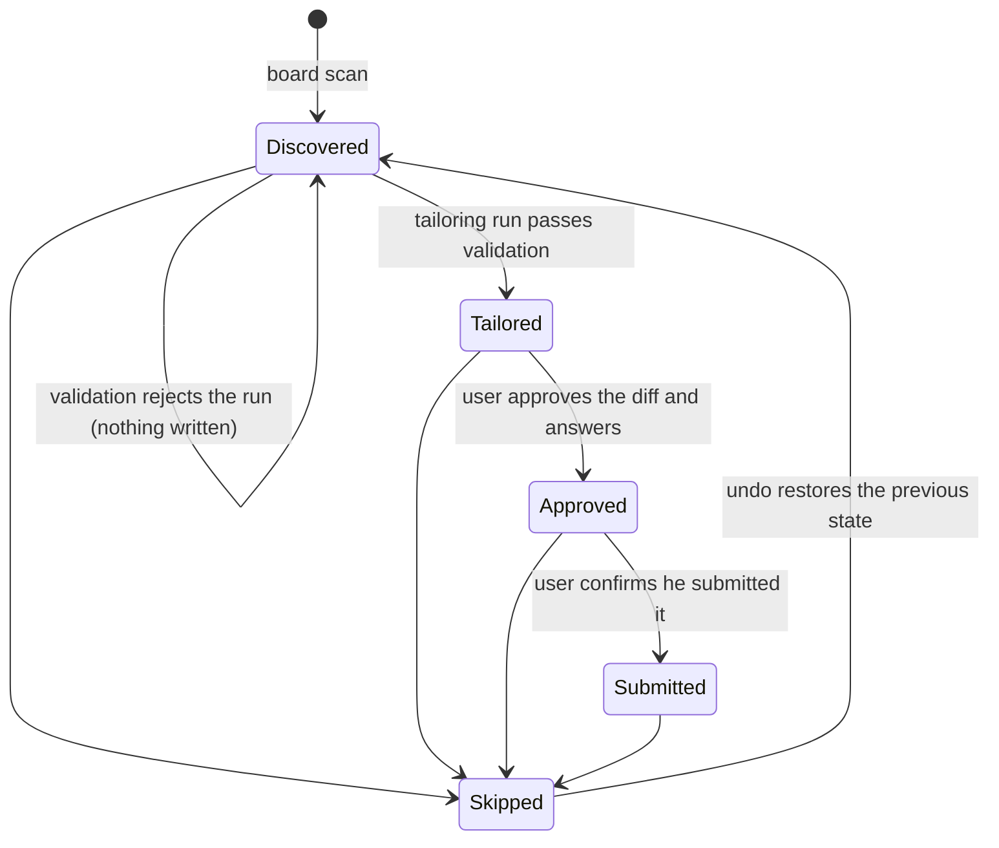

# Data model

Companion to [SPEC.md](SPEC.md). SQLite via Drizzle at `./data/tailor.db`.

## Tables

```
postings   id, source, external_id, company, role, location, url,
           description, found_at, score, state

runs       id, posting_id, created_at, model_output_json, outcome,
           rejection_reason, pdf_path

diff_items id, run_id, source_id, kind, original, proposed,
           user_edit, why, flagged, flag_why, resolved

answers    run_id, field, value
```

Notes:

- `postings.description` is plain text — HTML is stripped at fetch time.
- `postings.score` is the local tag-overlap score, not the model's score.
- Dedupe postings on `(source, external_id)`.
- `runs.model_output_json` stores the raw `ModelOutput` ([model-contract.md](model-contract.md)).
- `runs.outcome` is the terminal *pipeline* result — exactly one of `rejected | failed | completed`, written once. Overclaim flags (CAP-5) and blocked renders (CAP-6) are resolvable states recomputed from the persisted diff on read, never cached here.
- `diff_items.kind` is one of `reworded | kept | dropped` ([validation-and-diff.md](validation-and-diff.md)).
- `answers.field` is one of `workAuthorization | noticePeriod | whyThisCompany`.

**Keep every run, including rejected ones.** The fabrication log is useful signal about the prompt.

## Posting state machine

`postings.state` is one of `Discovered | Tailored | Approved | Submitted | Skipped`.



- A **failed validation leaves the posting `Discovered` and derives nothing** (Outcome A): no `diff_items`, no `answers`, no PDF, and an append to `rejections.log`. The `runs` row itself exists from the moment the run starts — polling and stage timing need a parent, and the fabrication modal must stay reachable — and it is kept with its stage timings, per "keep every run" above.
- `Approved → Submitted` happens **only** when the user confirms. The app cannot observe whether he actually submitted, and never guesses.
- `→ Skipped` is reachable from any state and is undoable from the toast, which restores the prior state.

## Row opening behavior

Clicking a queue row routes by state: `Discovered` → start tailoring, `Tailored` → review, `Approved` → handoff, otherwise review. The primary action button's label follows the same mapping (`Tailor` / `Review` / `Hand off` / `Open`).
